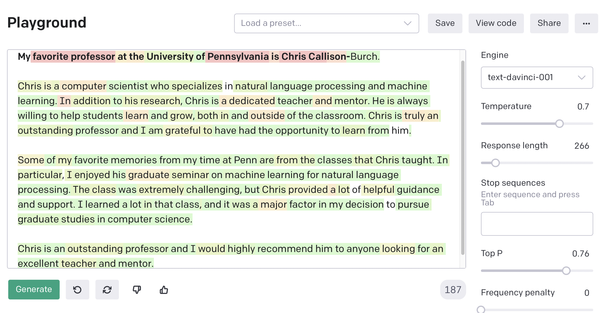

<!-- Check whether the assignment is ready to release -->
{{'now' | date: '%s'}}
{{page.release_date | date: '%s'}}
 
<div class="alert alert-danger">
Warning: this assignment is out of date.  It may still need to be updated for this year's class.  Check with your instructor before you start working on this assignment.
</div>

<!-- End of check whether the assignment is up to date -->


<!-- Check whether the assignment is up to date -->
{{'now' | date: '%Y'}}
{{page.due_date | date: '%Y'}}
 
<div class="alert alert-danger">
Warning: this assignment is out of date.  It may still need to be updated for this year's class.  Check with your instructor before you start working on this assignment.
</div>

<!-- End of check whether the assignment is up to date -->


<div class="alert alert-info">
This assignment is due on {{ page.due_date | date: "%A, %B %-d, %Y" }} before {{ page.due_date | date: "%I:%M%p" }}. 
</div>


<div class="alert alert-info">
You can download the materials for this assignment here:
<ul>

<li><a href="{{item.url}}">{{ item.name }}</a></li>

</ul>
</div>



{{page.type}} {{page.number}}: {{page.title}}
=============================================================

In this homework we're going to use Open AI to try to generate text adventure games automatically. Here's a conversation from 1992 on Usenet (a precursor to Reddit) assessing the feasibility of the idea, and forecasting when it might be possible:

```
From: goetz@acsu.buffalo.edu (Phil Goetz)
Subject: Re: Adventure generators (skippable)
Newsgroups: rec.arts.int-fiction
Date: 29 Oct 92 04:40:05 GMT
Sender: nntp@acsu.buffalo.edu
Organization: State University of New York at Buffalo/Comp Sci

Morpheus Nosferatu wrote:
> Has anyone ever worked on, or even heard of, an adventure generator?
>
> I’m not talking about an adventure design language like TADS or Alan,
> but rather a stand-alone adventure generator that produces complete
> adventures, where the user need only give a minimal degree of input,
> such as the level of complexity, type of adventure (mystery, treasure
> hunt, etc.), size of adventure, and so forth?
> ...
> But as anyone ever heard of someone trying to come up with a generator
> which would produce infocom-style text adventures? I can just imagine
> what kind of limitations it would have, but I’m curious to know if
> anyone has tried this, and if so what degree of success they’ve had.

No. The generator you speak of is not written, not being written,
and not anywhere on the horizon. In 50 years, maybe. In 20,
definitely not. The problem of writing interesting stories, which
adhere to someone’s definition of a plot (with goal explanations,
conflict, resolution, complication, climax, etc., all occuring at
appropriate intervals) is very hard, and I don’t expect a solution
soon. But the problem of writing clever puzzles involves much greater
creativity, and I have seen NO evidence that ANYBODY has a clue in
these creativity issues; the most you will find in the field are a
few vague theories of creativity.
This problem is what Stuart Shapiro calls "AI-complete": Solving it
would be equivalent to solving all the other problems of AI.
Phil
```

Phil Goetz predicted that it wouldn't be possible in 2012, but might be possible some decades after that.  Well, here we are 30 years after his prediction.  Can an AI system design a text adventure now? 


In this homework, you will use the OpenAI API for the first time.  We'll get you started by introducing you to the playground and introducing the notion of prompt design.  Then we'll show how to fine-tune the models to perform specific tasks, with a focus on our text adventure games from HW1. 

## Getting Started with the OpenAI API

You have been granted access to the [OpenAI API](https://openai.com), which lets you use GPT-3 a large, transformer-based language model like the ones that we learned about in lecture.  For the first part of the assignment, we'll get warmed up by playing with the OpenAI API via its interactive [Playground](https://beta.openai.com/playground) website.  Later we'll see how to integrate it directly into our code. 

First, let's learn some basic terminology: 
* Prompt - the input to the model
* Completion - what the model outputs

Let's try it out.  Try pasting this prompt into the playground, pressing the "Generate" button, and see what it says:

> My favorite professor at the University of Pennsylvania is 

Now try changing the prompt to 

> My favorite professor at the University of Pennsylvania is Chris Callison-

and genertaing again.  Now save its output for the end of the semester for your course reviews.  (Just kidding).  Here's an example of what it generated when I ran it. 


<center>

</center>
Here's another [impressive example of what GPT-3 knows about the field of NLP.](openai-playground-screenshot-2.png)

There are several controls on the righthand side of the playground.  These are
* Engine - GPT-3 comes in 4 different sized models. As the model sizes increase, so does their quality and their cost.  They go in alphabetical order from smallest to largest.    
1. Ada - smallest, least costly model.
2. Babbage
3. Curie
4. Davinci - highest quality and highest cost model.
* Response length - what's the maximum length (in tokens) that the model will output?
* Stop sequence - you can specify what tokens should cause the model to stop generating.  You can use the newline character, or any special sequence that you designate. 
* Show probabilities - allows you to highlight the tokens giving them different colors for how probable the models think they are.
* Temperature and Top P sampling - control how the model samples tokens from its distribution.
1. Setting Temperature to 0 will cause the model to produce the highest probablitity output.  Setting it closer to 1 will increase its propensity to create more diverse output.
2. Top P sampling controls the nucleus sampling, where the model samples from only the top of the distribution.
* Frequency Penalty and Presence Penalty - two parameters that help to limit how much repetition there is in the model's output.

### Prompt design

In addition to writing awesome reviews of your professors, you can design prompts to get GPT-3 to do all sorts of suprising things.  For instance, GPT-3 can perform [few-shot learning](https://arxiv.org/abs/2005.14165).  Given a few examples of a task, it can learn a pattern very quickly and then be used for classification tasks.  It often times helps to tell the model what you want it to do. 

Here's an example: in our text adventure games when we add a connection from one location to another, we add it in a certain direction (graveyard - West - tomb).  We'd like to add the inverse connection as well (tomb - East - graveyard).  Let's design a prompt to automatically get the opposite direction.  We could give it an instruction and two examples:


```
Given a direction, output the reverse of that direction: 
In - Out
Up - Down
East -
```

It will then generate "West".  Input "Ascend" it will generate "Descend".  I
Input "Go in through the Gate" and it will generate "Exit the Gate".

You can use the playground to create code based on a prompt that you can then use in your Python projects.  Click on the "View Code" button, and you'll get some code that you can convert into a Python function that takes a direction as input and returns the reverse direction.  For example: 


```python
import openai

prompt = "Given a direction, output the reverse of that direction: \nIn - Out\nUp - Down\nEast - West\nAscend - Descend\nGo in through the Gate - Exit the Gate\nClimb up the ladder - Descend the ladder\n"

def get_reverse_direction(direction):
  response = openai.Completion.create(
    engine="davinci",
    prompt=prompt + direction + " - ",
    temperature=0.7,
    max_tokens=20,
    top_p=1,
    frequency_penalty=0,
    presence_penalty=0,
    stop=["\n"]
  )
  return response['choices'][0]['text']
```

In addition to few shot learning, GPT-3 and other large language models do a pretty remarkable job in "zero-shot" scenarios.  You can give them instructions in natural language and often times, the produce remarkable examples.

If you input the prompt
> Generate 3 ideas for text adventure games.  Give the name of each game, and its setting.  Describe the game in a few sentences.  Give examples of puzzles that the player must solve, along with their solutions.

It outputs

>1. "The Lost Tomb of Pharaohs"
>
>In this game, the player must explore an ancient tomb in order to find the treasure that is hidden inside. Along the way, they must solve puzzles and overcome obstacles in order to progress.
>
>Some examples of puzzles that the player might encounter include: 
>- Finding a way to cross a chasm
>- Opening a locked door
>- Figuring out how to activate a mechanism
>
>The solution to each puzzle is usually hidden somewhere in the environment, and the player must use their wits and intuition to figure it out.
>
>2. "The Haunted Mansion"
>
>In this game, the player must explore a haunted house in order to find out what happened to the previous inhabitants. Along the way, they must solve puzzles and overcome obstacles in order to progress.
>
>Some examples of puzzles that the player might encounter include: 
>- Finding a way to open a locked door
>- Figuring out how to disable a trap
>- Solving a puzzle box
>
>The solution to each puzzle is usually hidden somewhere in the environment, and the player must use their wits and intuition to figure it out.
>
>3. "The Secret of the Crystal Cave"
>
>In this game, the player must explore a dark and foreboding cave in order to find a magical crystal. Along the way, they must solve puzzles and overcome obstacles in order to progress.
>
>Some examples of puzzles that the player might encounter include: 
>- Finding a way to cross a chasm
>- Opening a locked door
>- Figuring out how to activate a mechanism
>
>The solution to each puzzle is usually hidden somewhere in the environment, and the player must use their wits and intuition to figure it out.

Not bad!  Probably with a bit more prompt engineering or with one or two examples, we could get it to generate high quality game ideas.


## Fine-Tuning

Next, we'll take a look at how to [fine-tune the OpenAI models](https://beta.openai.com/docs/guides/fine-tuning) to perform a specific task.  You can use few-shot learning when you have a few dozen training example, and you can use fine-tuning when you have several hundred examples. When we have a few hundred training examples, then it's not possible to fit them all into a prompt, since GPT-3 has a limit of 2048 tokens in the prompt.  

For your homework, you'll fine-tune GPT-3 to generate different parts of text adventure games.  Specifically we'll train GPT-3 to
1. Generate descriptions of locations
2. List items that might be found in a location
3. Describe an item
4. Predict an item's properties

### Data

We are going to use a text adventure that was developed by Facebook AI Research for their paper [Learning to Speak and Act in a Fantasy Text Adventure Game](https://arxiv.org/abs/1903.03094).

Here's the paper's abstract:

> We introduce a large-scale crowdsourced text adventure game as a research platform for studying grounded dialogue. In it, agents can perceive, emote, and act while conducting dialogue with other agents. Models and humans can both act as characters within the game. We describe the results of training state-of-the-art generative and retrieval models in this setting. We show that in addition to using past dialogue, these models are able to effectively use the state of the underlying world to condition their predictions. In particular, we show that grounding on the details of the local environment, including location descriptions, and the objects (and their affordances) and characters (and their previous actions) present within it allows better predictions of agent behavior and dialogue. We analyze the ingredients necessary for successful grounding in this setting, and how each of these factors relate to agents that can talk and act successfully.

Their data is called the LIGHT dataset (Learning in Interactive Games with Humans and Text).  It contains 663 locations, 3462 objects and 1755 characters.  I have divided this data into training/dev/test splits.  We will use this data to fine-tune GPT-3 to generate descriptions of rooms and items.


### Colab Notebook

I have written a [Colab Notebook for Fine-Tuning OpenAI on LIGHT Enviroment Data](https://colab.research.google.com/github/interactive-fiction-class/interactive-fiction-class.github.io/blob/master/homeworks/generating-descriptions/Fine_Tune_OpenAI_on_LIGHT_Text_Adventures.ipynb).  The notebook shows you how to fine-tune GPT-3 to generate descriptions.  You then will implement code to fine-tune it for several other tasks.  

*Remember to make a copy of the notebook into your own Drive by choosing "Save a Copy in Drive" from Colab's "File" menu.*

In addition to working your way through my Colab Notebook, I recommend reading the [OpenAI documentation](https://beta.openai.com/docs/), and trying the examples in the Playground.

## What to submit

Please submit the following:
1. Your completed Colab Notebook
2. A set of generated game locations, items and connections in the same JSON format as the LIGHT data
3. A zip file with all training data files that you used to fine-tune your models
4. A PDF writeup that explains what you did in this homework.  You should say whether or not you think it's now feasible to fully generate text adventure games with AI.  What other pieces would you need to implement, in addition to what you did in this homework? Here's an [example writeup](example_writeup.pdf) that is roughly the level of quality that we expect.

You should submit your completed homework to [Gradescope]({page.submission_link}).  You can work in pairs.  Only one partner should submit - be sure to specify who your partner was when you make your submission. 

# Grading
<div class="alert alert-warning" markdown="1">
 * Fine-Tune Additional Models for Text Adventure Games - 11 points (1 point per function)
 * Generate A Game - 5 points
 * Evaluation - 5 points
 </div>
 
 
# Recommended readings

<table>
   
    <tr>
      <td>
	
		<a href="{{ publication.url }}">{{ publication.title }}</a>
        
		{{ publication.title }}
	
		      
		- {{ publication.authors }}.
	
		
		{{ publication.venue }}  {{ publication.year }}.
	

	
	<!-- abstract button -->
	<a data-toggle="modal" href="#{{publication.id}}-abstract" class="label label-success">Abstract</a>
	<!-- /.abstract button -->
	<!-- abstract content -->
	<div id="{{publication.id}}-abstract" class="modal fade" tabindex="-1" role="dialog" aria-labelledby="{{publication.id}}">
    <div class="modal-dialog" role="document">
      <div class="modal-content">
        <div class="modal-header">
          <button type="button" class="close" data-dismiss="modal" aria-label="Close"><span aria-hidden="true">&times;</span></button>
          <h4 class="modal-title" id="{{publication.id}}">{{publication.title}}</h4>
        </div><!-- /.modal-header -->
        <div class="modal-body">
        {{publication.abstract}}
        </div><!-- /.modal-body -->
	</div><!-- /.modal-content -->
	</div><!-- /.modal-dialog -->
	</div><!-- /.abstract-content -->
	
	
	<!-- bibtex button -->
	<a data-toggle="modal" href="#{{publication.id}}-bibtex" class="label label-default">BibTex</a>
	<!-- /.bibtex button -->
	<!-- bibtex content -->
	<div id="{{publication.id}}-bibtex" class="modal fade" tabindex="-1" role="dialog" aria-labelledby="{{publication.id}}">
    <div class="modal-dialog" role="document">
      <div class="modal-content">
        <div class="modal-header">
          <button type="button" class="close" data-dismiss="modal" aria-label="Close"><span aria-hidden="true">&times;</span></button>
          <h4 class="modal-title" id="{{publication.id}}">{{publication.title}}</h4>
        </div><!-- /.modal-header -->
        <div class="modal-body">
 	   <pre>{{publication.bibtex}}
           </pre>
        </div><!-- /.modal-body -->
	</div><!-- /.modal-content -->
	</div><!-- /.modal-dialog -->
	</div><!-- /.bibtex-content -->
	
</td></tr>
  
</table>
