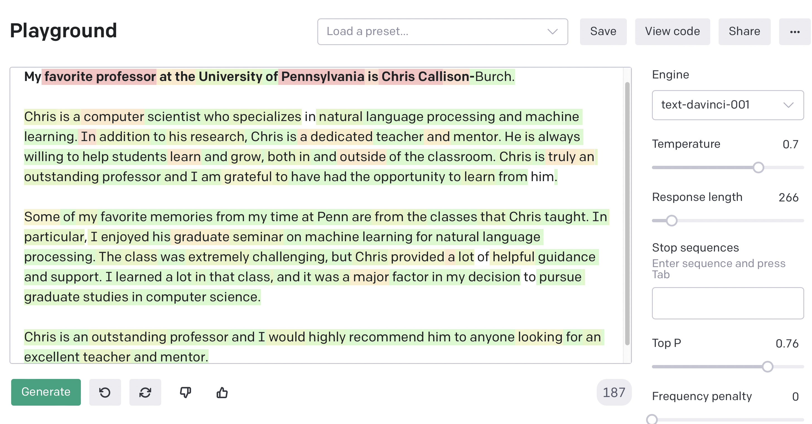

<!-- Check whether the assignment is ready to release -->
{{'now' | date: '%s'}}
{{page.release_date | date: '%s'}}
 
<div class="alert alert-danger">
Warning: this assignment is out of date.  It may still need to be updated for this year's class.  Check with your instructor before you start working on this assignment.
</div>

<!-- End of check whether the assignment is up to date -->


<!-- Check whether the assignment is up to date -->
{{'now' | date: '%Y'}}
{{page.due_date | date: '%Y'}}
 
<div class="alert alert-danger">
Warning: this assignment is out of date.  It may still need to be updated for this year's class.  Check with your instructor before you start working on this assignment.
</div>

<!-- End of check whether the assignment is up to date -->


<div class="alert alert-info">
This assignment is due on {{ page.due_date | date: "%A, %B %-d, %Y" }} before {{ page.due_date | date: "%I:%M%p" }}. 
</div>


<div class="alert alert-info">
You can download the materials for this assignment here:
<ul>

<li><a href="{{item.url}}">{{ item.name }}</a></li>

</ul>
</div>



{{page.type}} {{page.number}}: {{page.title}}
=============================================================


In this homework, you will use the OpenAI API to automatically for a number of tasks in a text adventure game.  We will use it to:
* Perform intent determination on user input to understand what command they are trying to invoke
* Generate descriptions of locations and items in the game
* Predict whether items have certain properties (like `gettable`)
* Generate ideas on how users might try to use an item (listing its "affordances")


## Intent Determination

For computer systems with natural language interfaces, and important task is **intent determination**.  For instance, when a user is talking to Amazon Alexa, it must determine if the user wants it to play music, check the weather forecast, order a product, etc.  After this initial determination, the system ususally forwards the user utterance to a specalized model to handle each individual task.  Language provides us with many different ways of articulating our goals, which makes intent determination a challenging task for computers. 

We will get started using OpenAI by showing how you can use it to perform intent dtermination for text adventure games.  In our first version of the Text Adventure Game, we had a simple keyword-based method of handling the player's intent.  The parser implemented a function called `get_player_intent` that took in a player's command and then decided which of the following actions a player was trying to accomplish:
* **Move** to a new location
* **Examine** an object
* **Get** an object
* **Drop** an object
* Perform a **special** action using an object
* Check the player's **inventory**
* **Redescribe** the scene
* Perform a **sequence** of actions

We collected user intent data during an in-class using [this Colab notebook](https://colab.research.google.com/github/interactive-fiction-class/interactive-fiction-class.github.io/blob/master/in_class_activities/intent-detection/Collect_Intent_Detection_Data.ipynb).  We elicited different natural langauge responses by showing the annotator a scene in the game and then asking them to describe how a user might express a paricular intent.

Here's an example of the annotation exercise.
```    
---
THE OPENING TO THE DRAWBRIDGE OF THE CASTLE
The trailhead to the forest is a dirt trail, dusty as it has not
rained in a while. The overhang of the trees is luscious and green
with only patches of sunlight beaming through the dense canopy. There
are many large trees, some with arrows still stuck in their trunks.
The trail is treacherous as it leads through the densest part of the
forest, through a stream and to a well-hidden castle. Once inside the
forest, the shade and canopy has provided plenty of opportunities for
foliage to grow making it harder to follow.

Exits: 
* North - Castle entrance
* Outside - Trailhead

You see: 
* arrows
* canopy
* foliage
* trees

How could a player say that they want to GET the ARROW?
>
```
The annotator might type in something like *retrieve the arrows from the tree*.  In doing so, they have created a training item that assicates that natural language command with the `get` intent, and the game command `get arrow`.  

### Create a Prompt for Intent Detection

Here is an example of one way that we can use the data to perform intent determination with the OpenAI API.  We will perform "few shot learning" by creating a prompt that includes each of the natural language commands that you created, followed by the intent, followed by a "stop sequence".  Here's a short sample of what our prompt looks like:

```
gather up the stones
get
###
go to the market
direction
###
collect a lily pad from the water
get
###
take a look at the lock's mechanism
examine
###
Is there any light in the dungeon?
redescribe
###
look at the food and head east
sequence
###
```

We will append a user command to the prompt, and then have OpenAI perform a completion.  If it has successfully learned the pattern in our prompt then it should predict one of the intents. For example if the user inputs `take the sword from its scabbard` then OpenAI should predict the intent `get`.

First, we can construct the prompt from the `intent.json` file.

```
import random

intent_json = load_json(filename)
intents = []

prompt = ""
for intent in intent_json:
  for command_info in intent_json[intent]:
    natural_language_command = command_info['natural_language_command'] 
    intents.append((natural_language_command, intent))

random.shuffle(intents)
for natural_language_command, intent in intents:
  prompt += natural_language_command + "\n"
  prompt += intent  + "\n"
  prompt += '###'  + "\n" # This will be our stop sequence

print(prompt)
```

To use this prompt with OpenAI, you can copy and paste it into the [OpenAI Playground](https://beta.openai.com/playground/).  Then you can type in a user command, and click on the "Generate" button and have it generate a response. Here's a screenshot:


<center>

</center>

In the screenshot above, I have set the stop sequence to be "###", which means that after the model generates that token, it will stop producing additional output.  If the model has learned the pattern from the few examples in our prompt, then it should follow the user command with an intent (like `get`) and then predict the stop sequence (which it doesn't output).

You can click on the "View Code" button to see code that will let you perform this generation from within a Python program rather than on the Playground website.  Here's an example of how you can wrap the code that it provides into a `get_player_intent` function.

```python
!pip install openai

from getpass import getpass
print('Enter OpenAI API key:')
openai_api_key = getpass()
```

```python
import openai
openai.api_key = openai_api_key

def get_player_intent(command):
  response = openai.Completion.create(
    engine="davinci",
    prompt=prompt + command + "\n",
    temperature=0.7,
    max_tokens=64,
    top_p=1,
    frequency_penalty=0,
    presence_penalty=0,
    stop=["###"]
  )
  return response['choices'][0]['text']
```

```python
command = "take the sword from its scabbard"
while command != "":
  command = input("> ")
  print(get_player_intent(command))
```

There are several other ways that you can use the OpenAI AI to perform intent detection.  The method above is an example of **few-shot learning and prompt engineering**. Another method is via **fine-tuning** one of the model.  I recommend that you read the [OpenAI API Documentation](https://beta.openai.com/docs/) which also describes classification, and embeddings.

For your HW, you should implement your own `get_player_intent` function.  We'll evaluate how good your method is based on running it on a set of held-out test data.

## Generating Descriptions

Next, we'll take a look at how to [fine-tune the OpenAI models](https://beta.openai.com/docs/guides/fine-tuning) to perform a specific task.  You can should few-shot learning when you a few dozen training example, and you can use tuning when you have several hundred examples. 

We are going to use a text adventure that was developed by Facebook AI Research for their paper [Learning to Speak and Act in a Fantasy Text Adventure Game](https://arxiv.org/abs/1903.03094).

Here's paper's abstract:

> We introduce a large-scale crowdsourced text adventure game as a research platform for studying grounded dialogue. In it, agents can perceive, emote, and act while conducting dialogue with other agents. Models and humans can both act as characters within the game. We describe the results of training state-of-the-art generative and retrieval models in this setting. We show that in addition to using past dialogue, these models are able to effectively use the state of the underlying world to condition their predictions. In particular, we show that grounding on the details of the local environment, including location descriptions, and the objects (and their affordances) and characters (and their previous actions) present within it allows better predictions of agent behavior and dialogue. We analyze the ingredients necessary for successful grounding in this setting, and how each of these factors relate to agents that can talk and act successfully.

Their data is called the LIGHT dataset (Learning in Interactive Games with Humans and Text).  It contains 663 locations, 3462 objects and 1755 characters.  I have divided this data into training/dev/test splits.  We will use this data to fine-tune GPT3 to generate descriptions of rooms and items.


## Predicting Item Properties

## Idea Generation for Affordances


# What to Submit
Submit a file `report.pdf` with your answers to the above questions. 


# Recommended readings

<table>
   
    <tr>
      <td>
	
		<a href="{{ publication.url }}">{{ publication.title }}</a>
        
		{{ publication.title }}
	
	{{ publication.authors }}.
	{{ publication.venue }}  {{ publication.year }}.

	
	<!-- abstract button -->
	<a data-toggle="modal" href="#{{publication.id}}-abstract" class="label label-success">Abstract</a>
	<!-- /.abstract button -->
	<!-- abstract content -->
	<div id="{{publication.id}}-abstract" class="modal fade" tabindex="-1" role="dialog" aria-labelledby="{{publication.id}}">
    <div class="modal-dialog" role="document">
      <div class="modal-content">
        <div class="modal-header">
          <button type="button" class="close" data-dismiss="modal" aria-label="Close"><span aria-hidden="true">&times;</span></button>
          <h4 class="modal-title" id="{{publication.id}}">{{publication.title}}</h4>
        </div><!-- /.modal-header -->
        <div class="modal-body">
        {{publication.abstract}}
        </div><!-- /.modal-body -->
	</div><!-- /.modal-content -->
	</div><!-- /.modal-dialog -->
	</div><!-- /.abstract-content -->
	
		
	<!-- bibtex button -->
	<a data-toggle="modal" href="#{{publication.id}}-bibtex" class="label label-default">BibTex</a>
	<!-- /.bibtex button -->
	<!-- bibtex content -->
	<div id="{{publication.id}}-bibtex" class="modal fade" tabindex="-1" role="dialog" aria-labelledby="{{publication.id}}">
    <div class="modal-dialog" role="document">
      <div class="modal-content">
        <div class="modal-header">
          <button type="button" class="close" data-dismiss="modal" aria-label="Close"><span aria-hidden="true">&times;</span></button>
          <h4 class="modal-title" id="{{publication.id}}">{{publication.title}}</h4>
        </div><!-- /.modal-header -->
        <div class="modal-body">
 	   <pre>{{publication.bibtex}}
           </pre>
        </div><!-- /.modal-body -->
	</div><!-- /.modal-content -->
	</div><!-- /.modal-dialog -->
	</div><!-- /.bibtex-content -->
	
</td></tr>
  
</table>