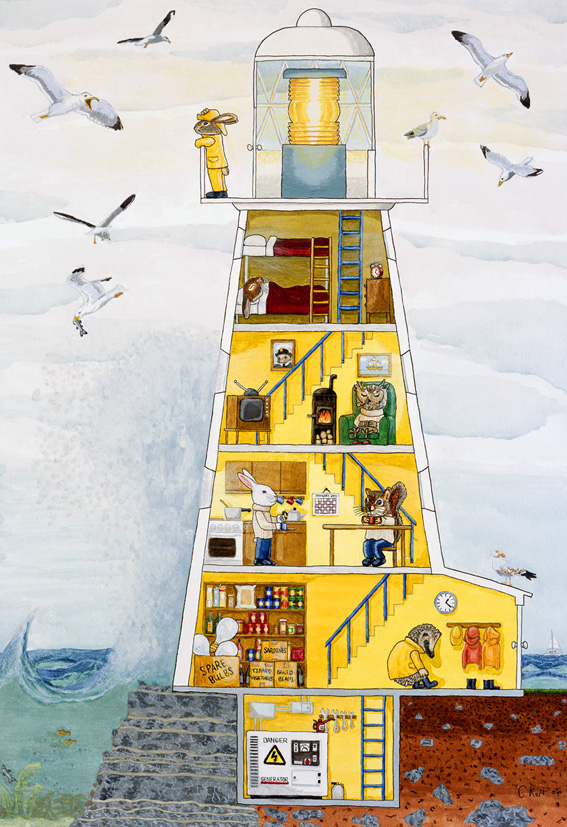
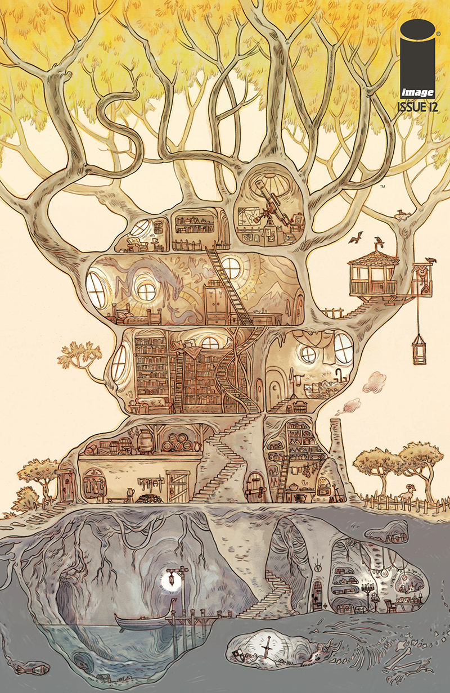
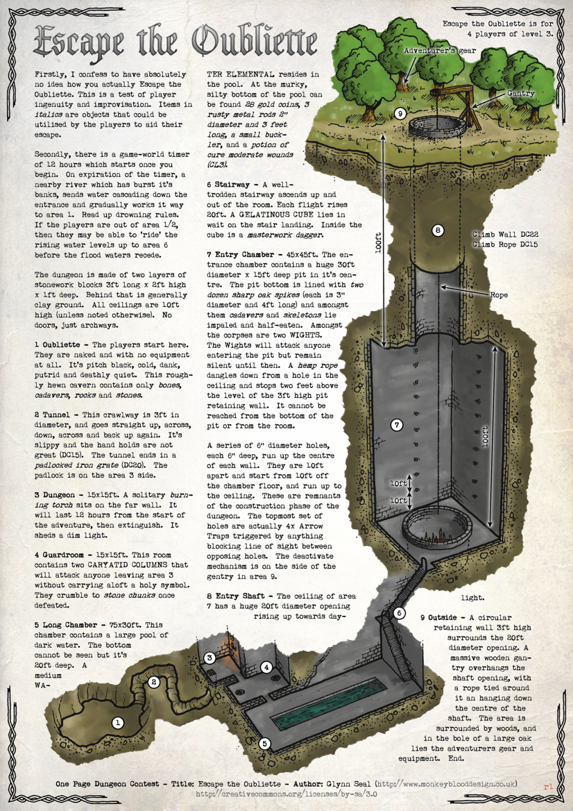
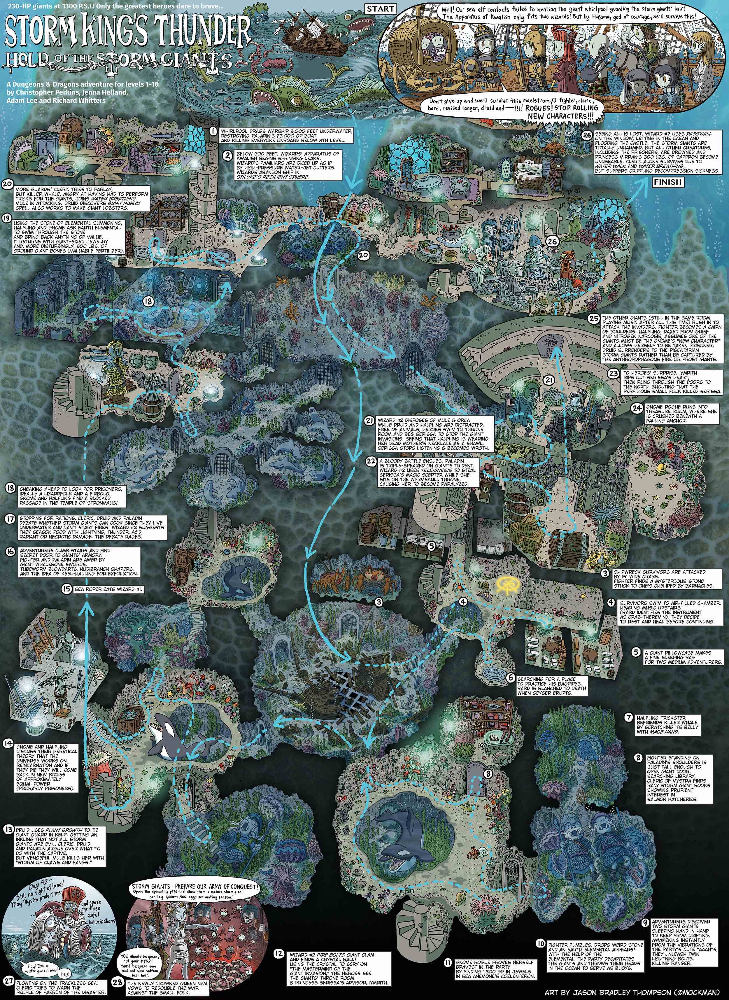
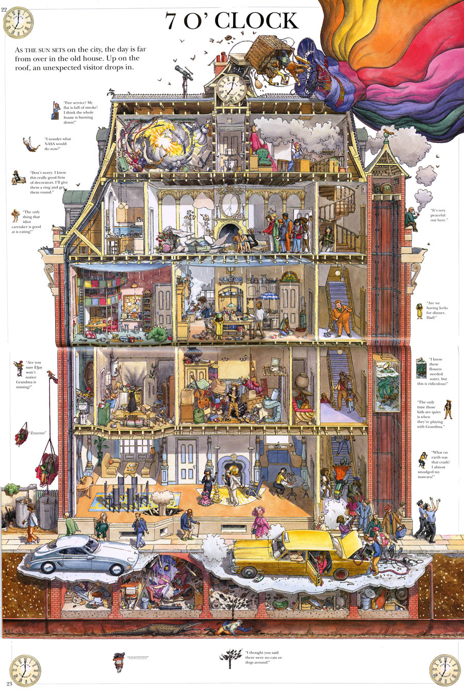

<!-- Check whether the assignment is ready to release -->
{{site.time | date: '%Y%m%d'}}
{{page.due_date | date: '%Y%m%d'}}
 
<div class="alert alert-danger">

Warning: this assignment is out of date.  It may still need to be updated for this year's class.  Check with your instructor before you start working on this assignment.
</div>

<!-- End of check whether the assignment is up to date -->


<!-- Check whether the assignment is up to date -->
{{'now' | date: '%Y'}}
{{page.due_date | date: '%Y'}}
 
<div class="alert alert-danger">
Warning: this assignment is out of date.  It may still need to be updated for this year's class.  Check with your instructor before you start working on this assignment.
</div>

<!-- End of check whether the assignment is up to date -->


<div class="alert alert-info">
This assignment is due on {{ page.due_date | date: "%A, %B %-d, %Y" }} at {{ page.due_date | date: "%I:%M%p" }} EST. 
</div>


<div class="alert alert-info">
You can download the materials for this assignment here:
<ul>

<li><a href="{{item.url}}">{{ item.name }}</a></li>

</ul>
</div>



{{page.type}} {{page.number}}: {{page.title}}
=============================================================


## Instructions

In this homework assignment, you will write your own classic text adventure game.  This homework can be completed in groups of up to 2 people.  You will implement two text adventure games.  One will be a re-implementation of the __Action Castle__ game, and one will be a game that you design yourself. The game that you design can be on any topic, or can tell any story of your choice.  We will play the games that you design during class, and part of your grade will be awarded based on how creative/exciting your classmates think your game is.

### Starter code

We have provided [starter code for a basic text adventure game](https://colab.research.google.com/github/interactive-fiction-class/interactive-fiction-class.github.io/blob/master/homeworks/text-adventure-game/Text_Adventure_Game.ipynb).  You are free modify it however you want, and bring in any dependencies you feel will be useful.

### Task 1: Implement Action Castle

Action Castle is a game by Jared A. Sorensen.  It is included in his book [Parsley](http://www.memento-mori.com/pdf/parsely-pdf), which is a collection of games inspired by the text-adventures of the 1980s.  Parsley is a party game where you take on the role of the parser, and the players shout out commands like GO NORTH, LIGHT LAMP or GET SWORD.  You obtusely follow player's commands, simulating a computer's limited vocabulary.  The effect is suprisingly hilarious and fun. 

You should download ["Parsely: Preview n' Play Edition"](http://www.memento-mori.com/pdf/parsely-preview-n-play-edition) which is free on Jared's website.  It contains the Action Castle game that you'll be implementing.  You can also [buy the full Parsley book for $20](http://www.memento-mori.com/pdf/parsely-pdf) if you'd like to support an awesome indy game developer.  The Preview n' Play Edition also explains how these kinds of games work.

You should modify the provided code to:
1. Create the 13 locations from Action Castle (Cottage, Garden Path, Fishing Pond, Winding Path, Top of the Tall Tree, Drawbridge, Courtyard, Tower Stairs, Tower, 
Dungeon Stairs, Dungeon, Great Feasting Hall, Throne Room).
2. Create the items for the game (fishing poll, rosebush, club, fish, the troll etc.).
3. Update the code so that it can handle the actions/commands/preconditions that are described by the Action Castle module.

<div class="alert alert-warning" markdown="1">
__Need a hint on how to get started?__ I as able to re-implement the whole of the Action Castle game$$^*$$ using the starter code by modifying the ```build_game``` function, the ```check_preconditions``` function, and by adding a few new methods to the [Special functions section](https://colab.research.google.com/github/interactive-fiction-class/interactive-fiction-class.github.io/blob/master/homeworks/text-adventure-game/Text_Adventure_Game.ipynb#scrollTo=YNrsHhpMTC8w).  None of the other starter code needed to be modified. It took me about 5 hours total to implement the game.

$$^*$$Except for this part: _The ghost will reach out for the player to stop his heart if the player lingers here._ I skipped that part of the game.
</div>


<div class="alert alert-warning" markdown="1">
__Advanced Hint:__ To do handle state changes (like the guard going from awake to unconscious), I used two Items to represent the different states, and then used a special function to perform multiple actions that would destroy Item and put the other Item in its place.  For example:
```python
  guard = Item("guard", "a guard carrying a sword and a key", "HE LOOKS AT YOU SUSPICIOUSLY.", start_at=courtyard)

  unconscious_guard = Item("unconscious guard", "an unconscious guard is slumped against the wall", 
  "HE HAS BITS OF BRANCH ON HIS UNIFORM.", start_at=nowhere)


  guard.add_action("hit guard with branch", perform_multiple_actions, 
      ([(destroy_item, (branch,"You swing your branch against the guard. It shatters to pieces.",
                               "You already tried that.")),
      (destroy_item, (guard,"The guard slumps over, unconscious.","")),
      (create_item, (unconscious_guard,"The guard's unconscious body lies on the ground.")),
      (create_item, (key,"His key falls from his hand.")),
      ]), preconditions={"inventory_contains":branch , "location_has_item": guard})
 
```  
There are other ways of handling this, and you're not obligated to use my way.  For instance, you might try using the Item's properties to record conditions like `unconscious`.
</div>

The starter code provides a vizualization method that displays a directed graph of the game that you have created.  If you'd like to compare your game graph against mine, you can look at [my vizualization of Action Castle](game-visualization.pdf).


### Task 2: Implement Your Own Creation

Your game should include all of the following:

* At least 3 Locations
* At least 3 Items that can be interacted with. These can be doors, keys, tools, ogres, etc.
* At least one "puzzle" where there are certain preconditions that must be met before the player can make forward progress.
* At least one "win" state and at least one "lose" state.

A fun example of a tiny game with very 3 locations and 3 items is the "Flaming Goat" game in Jared A. Sorensen's [Parsley book](http://www.memento-mori.com/pdf/parsely-pdf).  I played it with my 6 year old son, and it cracked him up.

Optionally, you can think about adding other elements to your game, like:
* Scoring
* Changes over time
* Interesting non-player characters

Feel free to modify the starter code in any way you see fit in order to enable your game ideas. However, the "Play the game" and "Visualize your game" code blocks should remain functional.

What kind of game should you make?  It's up to you! Be creative!  For inspiration, we recommend searching Pinterest for cross-section maps.  Here are some that we like:

<div class="container-fluid">
  <div class="row">
<div class="col-lg-4 col-md-6 col-xs-12" style="margin-bottom: 20px; height: 350px;">
<a href="inspiration/lighthouse.jpg"></a>
</div>
<div class="col-lg-4 col-md-6 col-xs-12" style="margin-bottom: 20px; height: 350px;">
<a href="inspiration/treehouse.jpg"></a>
</div>
<div class="col-lg-4 col-md-6 col-xs-12" style="margin-bottom: 20px; height: 350px;">
<a href="inspiration/oubliette.png"></a>
</div>
<div class="col-lg-4 col-md-6 col-xs-12" style="margin-bottom: 20px; height: 350px;">
<a href="inspiration/storm-king.jpg"></a>
</div>
<div class="col-lg-4 col-md-6 col-xs-12" style="margin-bottom: 20px; height: 350px;">
<a href="inspiration/mars.pdf"></a>
</div>
<div class="col-lg-4 col-md-6 col-xs-12" style="margin-bottom: 20px; height: 350px;">
<a href="inspiration/apartment.jpg"></a>
</div>
  </div>
</div>


<div class="alert alert-warning" markdown="1">
__Tip:__ I recommend drawing out on your game on [graph paper](http://print-graph-paper.com/) before you get started.
</div>

## What to submit

You should submit a link to a Github repository which contains the following:

1. An Python notebook called `action_castle.ipynb` that runs Action Castle. (You can use [Google Colab to view IPython Notebooks on Github](https://colab.research.google.com/github/googlecolab/colabtools/blob/master/notebooks/colab-github-demo.ipynb).)
2. An IPython notebook called `my_game.ipynb` that runs the initial version of your game.
3. A text file called `playthrough.txt` with all of the commands that we need to issue to complete your game. It shold be a plain text file with one command per line.
4. A text file called `README.md` containing a short paragraph describing your game, and why you picked that topic.

Submissions should be done on [Gradescope]({{page.submission_link}}).

## Grading
<div class="alert alert-warning" markdown="1">
* Implement Action Castle - 5 points
* Implement Your Own Creation - 5 points
</div>

 
## Recommended readings

* {{ reading.authors }}, <a href="{{ reading.url }}">{{ reading.title }}</a>.  <i>{{ reading.note }}</i>


