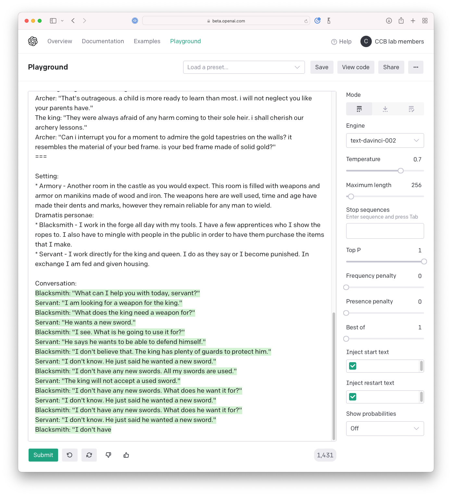

<!-- Check whether the assignment is ready to release -->
{{'now' | date: '%s'}}
{{page.release_date | date: '%s'}}
 
<div class="alert alert-danger">
Warning: this assignment is out of date.  It may still need to be updated for this year's class.  Check with your instructor before you start working on this assignment.
</div>

<!-- End of check whether the assignment is up to date -->



<!-- In class activity -->
<div class="alert alert-info">
This is the in-class activity for {{ page.release_date | date: "%A %B %-d" }}.
</div>

<!-- Homework assignment -->
<div class="alert alert-info">
This assignment is due on {{ page.due_date | date: "%A, %B %-d, %Y" }} before {{ page.due_date | date: "%I:%M%p" }}. 
</div>




<div class="alert alert-info">
The materials that you will need for this in-class activity are:
<ul>

<li><a href="{{item.url}}">{{ item.name }}</a></li>

</ul>
</div>



In Class Activity: Train GPT-3 to Perform Dialogue for NPCs
=============================================================

Today in class you will train GPT-3 to perform dialogue for non-player characters in games.  We will use a different part of [Facebook's LIGHT dataset](https://parl.ai/projects/light/), which we previously used to generate descriptions for items and locations in our text adventure games.  


# Characters and Dialogues in LIGHT 


Characters in the LIGHT dataset have a description and a persona, which is a first person description of who they are and what their motivations might be. Here are some examples of characters' names and their personas in LIGHT.

* Witches - I only mastered one spell in witch school. I can speak with inanimate objects. I use this spell in espionage. I work for the government.
* Queen - I am second in command under the king. I have a great power of authority. I am worshiped and seen as a wise and beautiful leader.
* King - I am a king of the whole empire. I give rules and pursuit them. I am brave and fearless.
* Dragon - I am a dragon living in the mountains. I enjoy hoarding treasure. I terrorize the local populace for fun.
* Knight - I am a knight. I come from a lower-ranking noble family. I serve under the king, as my father did before me. In times of war, I fight on horseback.
* Faeries - I giggle as I toss about my hair.  Some of the male faeries take notice and give chase.  How I love to tease them!  For they will never catch me.
* Talking Cat - I am a talking cat. I can speak to humans. I have scared many, many children.
* A Rat - I stick to the edge, nose up and ready for any morsels that may drop my way. Or sometimes they don't, but I often don't know until my jaws are upon it. A hunk of moldy crust, the edge of a dropped hymnbook, it is all fair game.
* A Spider - I am a black widow spider.  I am spinning my web.  I hope to catch something delicious.  I will sit and wait until something is caught in my web.  Then it is game over for them.
Ghosts - I am a ghost that haunts a castle. I do not recall how I came to exist. I make noises when I sense someone in my vicinity.

<!--
, a character type (person, creature or object), a location (```in_room_id```) and an inventory (```carrying_objects```).

Here is an example of the Gravedigger character.
```python
light_environment['characters']['203']

{'base_form': ['gravedigger'],
 'carrying_objects': [890],
 'char_type': 'person',
 'character_id': 203,
 'corrected_name': 'gravedigger',
 'desc': 'You might want to talk to the gravedigger, specially if your looking for a friend, he might be odd but you will find a friend in him.',
 'ex_room_ids': [100, 349],
 'in_room_ids': [62],
 'is_plural': 0,
 'name': 'gravedigger',
 'orig_room_id': 349,
 'personas': ["I am low paid labor in this town. I do a job that many people shun because of my contact with death. I am very lonely and wish I had someone to talk to who isn't dead."],
 'wearing_objects': [],
 'wielding_objects': []}
 ```
-->


Here is an example conversation from the LIGHT dataset.  It's a dialogue between two characters in a specific setting.  Each character takes a turn in the conversation, which can consist of a line of dialogue, or an action (which I've maked as "stage direction" as if this were a play), or they can make a gesture (called an *emote* in the LIGHT data).

> **Setting:**
> * Watchtower - The tower is the largest section of the castle. It contains an observatory for nighttime scouting, but is also used by the wise men to study the stars. Armed guardsmen are always to be found keeping watch. 
>
> **Characters:**
> * Court wizard - I am an advisor of anything magical. I sell spells to those who need them. I am wealthy and hold an important place in political life
> * Soldier - I came from the fertile valley when I was conscripted. The king needed strong farmer's sons to fight in the war. I am very unhappy here in the cold, damp, rainy north. I miss my friends and my dog. I hope to go back to my father's farm when the war ends.
>  
> **Conversation:** <br />
> Court wizard: "A quiet night this evening..." <br />
> Soldier: "Yes it is" <br />
> Court wizard: "Have any else come up this eve? i had hoped for a quiet night to examine the stars" <br />
> Court wizard: Gestures - Ponder <br />
> Soldier: "Yes, a few came through, but it is a cold night for me, i am used to warmer weather" <br />
> Soldier: Gestures - Nod <br />
> Court wizard: "Well, you are but a common soldier.  no doubt you are used to such a lot.  thankfully i have my spells to keep me warm." <br />
> Court wizard: Gestures - Sigh <br />
> Soldier: "I am a soldier doing my job" <br />
> Soldier: Gestures - Grin <br />
> Court wizard: "Yes... well... very well then.  see that you do!  no slacking off while your betters are about." <br />
> Soldier: "No sir" <br />
> Court wizard: "When, for example, was this horn last tested?  it looks dented.  how can we be sure it will work?" <br />
> Soldier: "A year ago, test it out or cause a need to use it" <br />
> Court wizard: "Mayhap i will speak to the king about such lackness.  or perhaps i can sell him a spell that will serve just as well." <br />
> Court wizard: Gestures - Frown <br />
> Soldier: "Good idea, i agree, go do that" <br />
> Soldier: Stage Direction - Hug court wizard <br />
> Court wizard: "Get off of me, you fool!  who gave you permission to touch me!" <br />
> Court wizard: Stage Direction - Hit soldier <br />
> Soldier: "To the jail with you" <br />
> Soldier: Stage Direction - Hit court wizard <br />

# Training GPT-3 To Perform the Dialogue

We will use the OpenAI API to perform dialogue in a similar style to the LIGHT dialogue.  We will try two approaches:
1. Few-shot learning
2. Fine-tuning

You can start out by experimenting with few-shot learning on the [OpenAI playground](https://beta.openai.com/playground).  All you need to do is copy and paste two or three of the LIGHT dialogues into the playground.  Then add the appropriate infomation for the conversation that you want to generate.  Like the settings and the characters.  If you use all that as the prompt, then GPT-3 should generate something like this:

<center>

</center>


If you want to change its behavior so that it it only generates one line at a time, then you can enter the newline character into the "Stop sequences" field on the right.  (To do this, click in the textbox, press Return, and then press Tab).

If you set it up to generate one line of dialogue at a time, then you can have it play one of the characters, and you can play the other character by typing in your response.  This should be a reasonable starting point for dialogue in an interactice fiction game.


# What to do

1. Open the [{{page.materials[0].name}}]({{page.materials[0].url}}).
2. Save a copy of the notebook into your own drive. Choose `File > Save a copy in Drive`.
3. Read through the code, and fill in the TODO sections.
4. Complete the Few Shot Learning section and the Fine-Tuning section.
5. Try creating coversations for Action Castle between the player and some of the NPCs.  You could have GPT-3 generate dialogue for
- The troll at the drawbridge
- The princess at the tower
- The ghost of the king in the dungeon
save your sample conversations as a file called `action_castle.txt`
6. Submit your completed notebook and your `action_castle.txt` file to [Gradescope]({{page.submission_link}}).


 
## Related Readings

* {{ reading.authors }}, <a href="{{ reading.url }}">{{ reading.title }}</a>.  <i>{{ reading.note }}</i>



