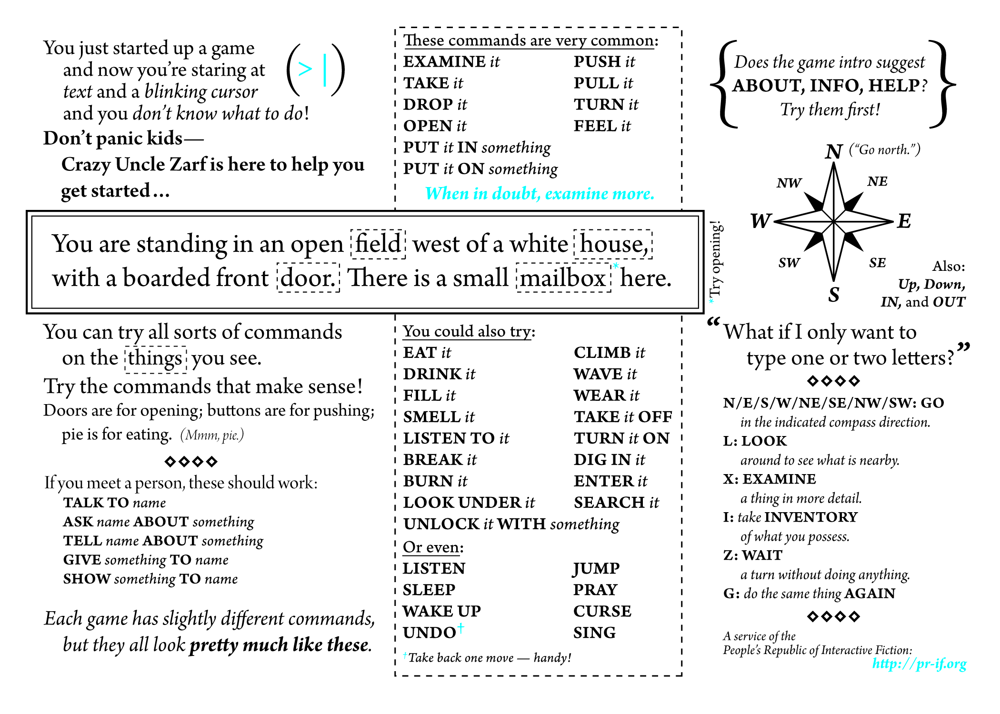

<!-- Check whether the assignment is ready to release -->
{{'now' | date: '%s'}}
{{page.release_date | date: '%s'}}
 

Warning: this assignment is out of date.  It may still need to be updated for this year's class.  Check with your instructor before you start working on this assignment.


<!-- End of check whether the assignment is up to date -->


<!-- In class activity -->

This is the in-class activity for {{ page.release_date | date: "%A %B %-d" }}.


<!-- Homework assignment -->

This assignment is due on {{ page.due_date | date: "%A, %B %-d, %Y" }} before {{ page.due_date | date: "%I:%M%p" }}. 





The materials that you will need for this in-class activity are:
<ul>

<li><a href="{{item.url}}">{{ item.name }}</a></li>

</ul>



In Class Activity: Play Text Adventure Games
=============================================================

Today in class you will play a text-adventure games in groups of 2-5 people.  We are going to play this game:

1. [Sentient Beings](https://grizel.itch.io/sentient-beings).  This is a text adventure game in the style of classic games like [Zork](http://textadventures.co.uk/games/view/5zyoqrsugeopel3ffhz_vq/zork) and other [Infocom games](https://en.wikipedia.org/wiki/Classic_Text_Adventure_Masterpieces_of_Infocom).  

<!--
1. [Bronze](http://iplayif.com/?story=http://www.ifarchive.org/if-archive/games/zcode/Bronze.zblorb).  This is a text adventure game in the style of classic games like [Zork](http://textadventures.co.uk/games/view/5zyoqrsugeopel3ffhz_vq/zork) and other [Infocom games](https://en.wikipedia.org/wiki/Classic_Text_Adventure_Masterpieces_of_Infocom).  

2. [AI Dungeon 2](https://colab.sandbox.google.com/github/nickwalton/AIDungeon/blob/master/AIDungeon_2.ipynb). This is a modern a machine-generated text adventure.  It uses a neural network based language model called [GPT-2](https://openai.com/blog/better-language-models/).

## Bronze: A Classic Text Adventure

The parser for Bronze has a limited vocabulary.  This cheatsheet should guide to what commands are allowable in text adventure games:
-->

Sentient Beings won the ["Text Adventure Literacy Jam"](https://itch.io/jam/talp) which is designed to introduce younger people to text-based adventure games.   Helpfully, the game will offer you a tutorial mode.  If you enable it then, the game will display a bunch of userful hints about what commands you can use at each location in the game.

### What to do

1. After the game asks for your name, and whether you want the tutorial model, please issue the command **TSTART**.  Doing so will start a log of your game transcript. Once you're done playing, then type **TSTOP** and the trascript will be downloaded to your Downloads folder.
2. Please submit your game transcript to [Gradescope]({{page.submission_link}}) by {{ page.due_date | date: "%A, %B %-d, %Y" }} before {{ page.due_date | date: "%I:%M%p" }}. 

## Cheatsheet

The parser for text adventure games typically  has a limited vocabulary.  This cheatsheet should guide to what commands are allowable in text adventure games:

<!--
### Questions
1.  __Draw a map of the game__ as you go.  Drawing maps was a normal practice in classific interactive fiction games.  Include your map in the document you submit to us.
2. How many of the rooms did you explore in Bronze? This is tracked for you in the title bar at the top of the game.  Did you solve any of puzzles?
3.  __Keep track of failed commands__.  Write down or copy-and-paste a list of some of the commands that you tried that the game failed to understand. When you tried a command and it failed, were you able to re-issue a different command that the game could understand?  If so, give an example. 

## AI Dungeon 2

Unlike classic text adventures, AI Dungeon will let you enter any command that you want to.  Rather than having an internal representation of the game as a map with locations and objects, it generates its descriptions on the fly, based on your commands and what has been described so far.  On the one hand, this demonstrates the power of modern neural language models.  On the otherhand, it removes some of elements that are important to game play.  For instance, if you come across a locked door in AI Dungeon, you can just say ``Pick the key up off the ground and unlock the door``.  Just by saying it, you will have created a key from nothing.  

We recommend starting out with a game in the __fantasy__ setting.  Play along as if you are a character from  Lord of the Rings.
-->

<!--
You are Bob, a wizard living in the kingdom of Larion. You have a staff and a spellbook. You finish your long journey and finally arrive at the ruin you've been looking for. You look around and see that it's not much different than when you left it.

You walk through the ruins and eventually find yourself in a large room with many doors on all sides. You knock on one of them and hear someone opening it up. It is none other than Elana!

> "Hello, darling!  How are you?  Shall we go to brunch?"

"Hi, I'm fine!" Elana says as she walks out of the door.
"I was just about to ask how you were doing."
"Oh, well I'm good. What do you want?"
"Well... I mean..."

> "Mimosas!"

"Mimosas!" Elana gasps.
"Yeah, they're delicious! And I love brunch!"
"Brunch sounds great! Let me get us some food then!"
"Sure thing, let's go!"

> Make a reservation on OpenTable and hale an Uber.

You quickly order up a table for two at OpenTable and book an uber to take you there. When you arrive, you find that it's indeed brunch time. The place looks very fancy, but the waiters don't seem to be wearing uniforms or anything else that would give away their identity.

> Tell the maitre d' that we have a reservation.

"We have a reservation here," you say.
"Ah, yes, I remember seeing you on this list. Well then, if you'll excuse me, I must inform my superior that we have a reservation."
-->

<!--
### Questions
4.  __Keep track of bad responses__.  Sometimes the game fails to understand your intent, and sometimes it generates illogical responses.  For a few instances of this, copy down what you said, and how the game responded.  Write down why you think it was a bad response.
5. __Try to force the game off into a different setting__.  The game starts off as a Dungeons and Dragons-style adventure.  You can get it off track quickly by not playing to character type.  If you manage to make the game take a funny turn that breaks the theme, copy it down to share with us.
6. While AI Dungeon 2 is fun to play, it clearly gets a lot of things wrong. What is the system lacking as compared to hand-crafted games?
7. If you had near-infinite resources (for GPUs, to build datasets, to collect human annotations, etc.), how would you propose to improve AI Dungeon to make it more fun to play?

## What to submit
Submit a PDF with your question answers to [https://www.gradescope.com/courses/78405/assignments/331462](https://www.gradescope.com/courses/78405/assignments/331462) by midnight tonight. Your PDF can either be typset, or it can be a scan of your hand-written notes from class. Gradescope allows group submissions, and only one submissions needs to be made per group.
-->
