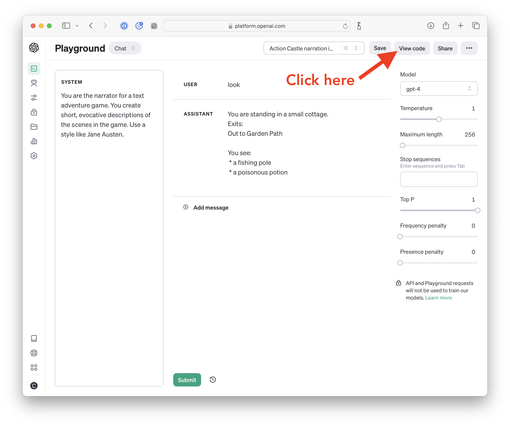
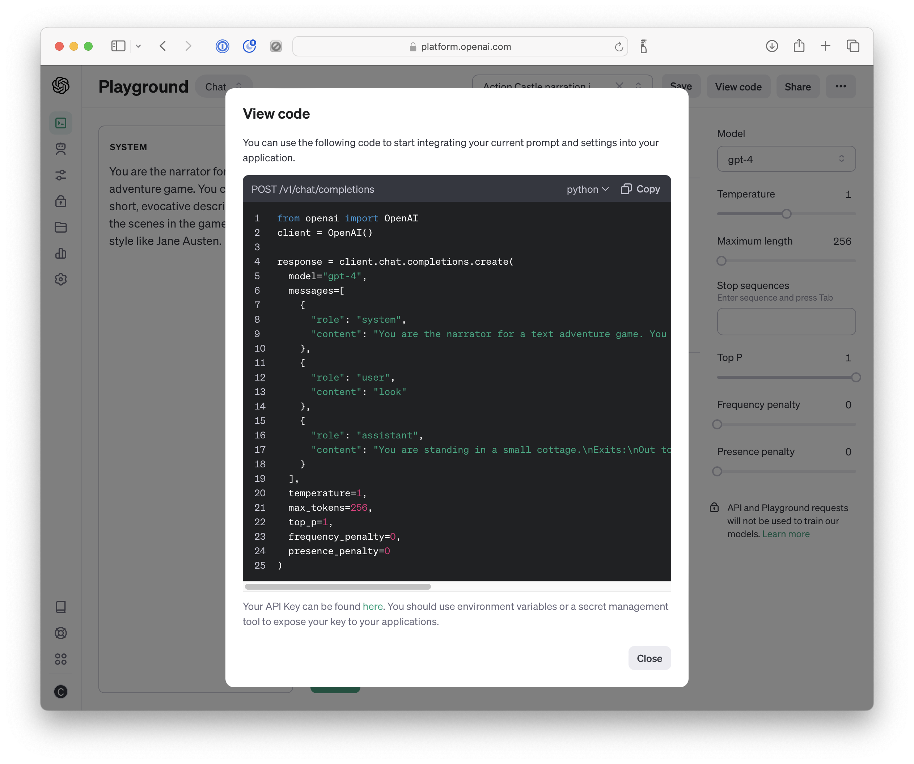

<!-- Check whether the assignment is ready to release -->
{{'now' | date: '%s'}}
{{page.release_date | date: '%s'}}
 
<div class="alert alert-danger">
Warning: this assignment is out of date.  It may still need to be updated for this year's class.  Check with your instructor before you start working on this assignment.
</div>

<!-- End of check whether the assignment is up to date -->


<!-- Check whether the assignment is up to date -->
{{'now' | date: '%Y'}}
{{page.due_date | date: '%Y'}}
 
<div class="alert alert-danger">
Warning: this assignment is out of date.  It may still need to be updated for this year's class.  Check with your instructor before you start working on this assignment.
</div>

<!-- End of check whether the assignment is up to date -->


<div class="alert alert-info">
This assignment is due on {{ page.due_date | date: "%A, %B %-d, %Y" }} before {{ page.due_date | date: "%I:%M%p" }}. 
</div>


<div class="alert alert-info">
You can download the materials for this assignment here:
<ul>

<li><a href="{{item.url}}">{{ item.name }}</a></li>

</ul>
</div>



{{page.type}} {{page.number}}: {{page.title}}
=============================================================

In this homework assignment, you will replace the `Parser` class from [HW1: Build a Text-Adventure Game](../text-adventure-game/text-adventure-game.html).   Instead of using keyword-based parsing, as was done in old-school text adventure games, we'll see how we can use large language models (LLMs) like GPT.  This will allow us to do two important thigs:

1. We can use the LLM to generate more evocative descriptions.
2. We can do more flexible matching of user commands.

This homework can be completed in groups of up to {{page.group_size}} people. Everyone must finish parts 1-3.  If your group larger than 2, then you must do one extension for each team member beyond 2. 


## The Parser class

The Parser is the class that handles the player's input.  The player types in a command, and the parser performs natural language understanding in order to interpret what action the player intended, and then describes what happens when the action is applied in the game world.

The parser has several functions that you will rewrite.  They include:
* Functions to describe things (`ok` and `fail`)
* A function to determine what action the user wants to do (`determine_intent`)
* Several functions to match part of the user's command (`get_character`, `match_item`, and `get_direction`)

To see what these functions do, it might be worth looking over the initial `Parser` class, which uses keyword based matching.  You'll extend this class and override these methods. 


### Using our Starter code

We have provided [starter code for your GPT Parser]({{page.materials[0].url}}).  I recommend using Visual Studio Code for this homework. You'll be making changes to the `HW2.ipynb` file, which has a `GptParser` class with placeholder code for you to update.

#### Environment Setup

To run this code in your Python IDE, you'll need to install the openai python package via `pip`, and you'll need to set an environment variable called `OPENAI_API_KEY`.


First [download the zip file]({{page.materials[0].url}}), then create a virtual environment and install
the dependencies.  Here's how I recommend that you set up your environment:
```
$ unzip CIS-7000-HW2.zip
$ cd CIS-7000/HW2/
$ python3 -mvenv venv
$ source venv/bin/activate
(venv) $ pip install -e .'[dev]'
(venv) $ pip install openai tiktoken
```

If you're using VS code then you can send your OPENAI_API_KEY to it when you launch it from the command line:
```
$ cd path/to/homework/CIS-7000/HW2/
$ source venv/bin/activate
(venv) $ OPENAI_API_KEY=sk-XXXXXXXXXXXXXXX   code .
```
You should replace `sk-XXXXXXXXXXXXXXX` with your OpenAI API key, which you can find [here](https://platform.openai.com/api-keys).  


## Part 1: Using GPT to Write Descriptions

For this part of the homework, you can use what you learned [the in-class OpenAI Playground activity](../../in_class_activities/openai-playground/openai-playground.html).  Specifically, you can use the system prompt that you designed to perform narration for text adventure games.  Rather than using the OpenAI playground to invoke GPT, we will start calling the API.  

The playground has a "View Code" button that will show you how to call the API.  First, open the link to the prompt that you developed in the in-class activity, then click "View Code".

<center>

</center>

The playground will then give you sample code that includes your __System prompt__, as well as any __User__ input and __Assistant__ outputs from your playground.


<center>

</center>


You can click on the `copy` button to copy the code to your clipboard, and then you can paste it into your Python IDE.


```python
from openai import OpenAI
client = OpenAI()

response = client.chat.completions.create(
  model="gpt-4",
  messages=[
    {
      "role": "system",
      "content": "You are the narrator for a text adventure game. You create short, evocative descriptions of the scenes in the game. Use a style like Jane Austen."
    },
    {
      "role": "user",
      "content": "look"
    },
    {
      "role": "assistant",
      "content": "You are standing in a small cottage.\nExits:\nOut to Garden Path\n\nYou see:\n * a fishing pole\n * a poisonous potion\n"
    }
  ],
  temperature=1,
  max_tokens=256,
  top_p=1,
  frequency_penalty=0,
  presence_penalty=0
)
```

If you run this code in a Python notebook and then:
```python
print(response.choices[0].message.content)
```
you will get output similar to this (I picked my favorite prompt which was in the style of Jane Austen):

> As our hero, you find yourself ensconced within the humble confines of a quaint little cottage, possessing an air of simplistic beauty reminiscent of fine, unadorned porcelain. Your gaze is drawn to a rustic fishing pole, resting unassumingly against a worn dresser. Is it not a symbol of life's simple pleasures, reminding one of serene mornings by the water, entranced by the lulling whispers of the breeze?
> In stark contrast, perched on the ragged wooden table, is a vial of venomous potion; a silent testament to the darker machinations of life. It pulses with a malevolent glow, beckoning through the deceptive allure of its shimmering surface.
> The only exit from this paradox of purity and peril is a weather-beaten door leading to a bucolic garden path. Behind its worn surface, trepidation and expectation mate in an elusive dance, as unpredictable as life itself.

Congrats!  You've run your first API call to GPT-4, and you have created more evocative text than our original game output.

For part 1, you should implement the `ok` and `fail` functions, which can use `gpt_describe` that we provide you with.  You should also implement the `limit_context_length` function, which will ensure that you don't send more tokens to GPT than its maximum. 

After you finish part 1, you should play Action Castle using your GptParser class.  Save a transcript of your play to submit along with your homework solution.  I recommend trying several commands that don't work.  Also, be on the look out for "hallucinations" by GPT, which in this context are elaborations that it adds that aren't part of the underlying game.  Try to interact with hallucinated objects and see what happens.  Is the underlying game state maintained?  Include a discussion of this in your homework writeup. 


## Part 2: Intent Determination  

The keyword-based parser for our HW1 text adventure game could only match very specific commands.  We could win the fishing mini game with this sequence of commands: 
1. take pole
2. go out
3. south
4. catch fish with pole
5. eat fish

However, if the user tried some other very similar commands, the simple keyword based parser wouldn't understand the meaning of these commands.

1. pick up the fishing pole
2. head outside
3. go down to the fishing pond
4. go fishing with the pole
5. I'm starving so I swallow the fish whole 

If you try these commands using your GptParser, it won't work properly until you add additional special handling.  In fact, you might get out of sync with the game state. 

In this part of the homework, we'll extend your GptParser to more flexibly match user commands.  For this part of the homework, we'll implement a new version of the `determine_intent`.  Intent determination is a common task for dialogue systems.  For instance, when you ask Amazon Alexa "Is it raining?", it determines that your intent is to `check_weather` and it routes your command to that function.  When you ask it to "play Why Does It Always Rain On Me?" it determines that your intent is to `play_music` and starts playing [a nice single from 1999](https://www.youtube.com/watch?v=PXatLOWjr-k).  If you'd like to read more about intent determination in NLP, you can reach [Chapter 15 "Chatbots & Dialogue Systems" in the Speech and Language Processing textbook](https://web.stanford.edu/~jurafsky/slp3/15.pdf).


There are several possible ways that you could flexibly match a user's input.  

* You could try using the [embeddings API](https://platform.openai.com/docs/guides/embeddings) 
* You could ask GPT-4 to pick the closest matching output from a list that you provide. 
* You could fine-tune GPT-3 to perform the task using [the fine-tuning API](https://platform.openai.com/docs/guides/fine-tuning). 

For my solution,  picked the second one. To ensure that I returned 
exactly the ACTION_NAME and not some longer text, I had to carefully craft 
my instructions to GPT, and eventually I resorted to using a regular 
expression over GPT's output).   

After you finish part 2, you should test your `determine_intent` by coming up with a list of user command and what they should map to.  Report your results in the README that you submit with your homework. 


## Part 3: Argument Matching

After we've determined which of the Actions the user wants to perform, we need to flexibly match its arguments. If I user says "get the fishing rod", we want to execute the game command "get pole" even though the user didn't use the word "pole".

There are three functions that you'll implement on your GptParser class for this part of the homework: `get_character`, `match_item` and `get_direction`.  These are used by most of the Action classes when they parse a user's command, so making them more flexible ought to have the effect of more flexibly matching Actions' arguments.  

After you finish part 3, you should play Action Castle again using your new GptParser3 class. While you play try to use only commands that would not have been allowed by our HW1 game. Save a transcript of your play to submit along with your homework solution.  In your README, describe any commands that you tried that didn't work, and why you think the failed.

## Optional Extensions

If you're working in a group larger than a pair, then you should pick one optional extension for each group member above 2.  

Possible extensions are:
* You can compare several approaches to intent determination, and quanify how good each approach is on an extended test set that you put together.
* You can generate images for each location in the game using [DALLE-3](https://platform.openai.com/docs/guides/images/image-generation?context=node) or [Midjourney](https://github.com/erictik/midjourney-api)
* You can narrate your game with text to speech using [the OpenAI API](https://platform.openai.com/docs/guides/text-to-speech) or [ElevenLabs](https://elevenlabs.io)
* You can use GPT to transform commands that describe multiple actions into a list of actions for proper handling with ActionSequence.  
* When something's properties change, you should have GPT rewrite its description to reflect the change.  For example, in Action Castle when the guard is knocked unconscious, the description of the guard should include this fact.
* You can try to take the GPT descriptions and create in-game objects from them.  After you create the objects, you can save your game using the built in `game.to_json` and then load it later using  `game.from_json`.


## What to submit

Please submit the following:
1. Your completed hw2.ipynb Python notebook
2. Two transcripts (`game_transcript_with_GPT_descriptions` and `game_transcript_with_flexible_commands.json`) showing your playthroughs after parts 1 and 2
3. A README.md with your write-up.  
* For part 1 of the homework, your README should analyze your playthrough and discuss hallucinations and game state. 
* For part 2 of the homework, your README you should describe how you tested your `determine_intent` function.  You should perform an error analysis by looking at its outputs and seeing what commands caused it to predict the wrong answer.  Speculate why.
* For part 3 of the homework, your README should analyze your second playthrough and discuss what commands didn't work and why.
* For each extension that you do, please describe in detail what you did in your README.  You should also submit any accompanying code for your extensions along with zip file of images, voice outputs, or saved games.

You should submit your completed homework to [Gradescope]({page.submission_link}).  You can work in groups of up to {{page.group_size}}.  Only one partner should submit - be sure to specify who your partner was when you make your submission. 

<!--
# Grading
<div class="alert alert-warning" markdown="1">
 * Fine-Tune Additional Models for Text Adventure Games - 11 points (1 point per function)
 * Generate A Game - 5 points
 * Evaluation - 5 points
 </div>
-->
 
 
# Recommended readings

<table>
   
    <tr>
      <td>
	
		<a href="{{ publication.url }}">{{ publication.title }}</a>
        
		{{ publication.title }}
	
		      
		- {{ publication.authors }}.
	
		
		{{ publication.venue }}  {{ publication.year }}.
	

	
	<!-- abstract button -->
	<a data-toggle="modal" href="#{{publication.id}}-abstract" class="label label-success">Abstract</a>
	<!-- /.abstract button -->
	<!-- abstract content -->
	<div id="{{publication.id}}-abstract" class="modal fade" tabindex="-1" role="dialog" aria-labelledby="{{publication.id}}">
    <div class="modal-dialog" role="document">
      <div class="modal-content">
        <div class="modal-header">
          <button type="button" class="close" data-dismiss="modal" aria-label="Close"><span aria-hidden="true">&times;</span></button>
          <h4 class="modal-title" id="{{publication.id}}">{{publication.title}}</h4>
        </div><!-- /.modal-header -->
        <div class="modal-body">
        {{publication.abstract}}
        </div><!-- /.modal-body -->
	</div><!-- /.modal-content -->
	</div><!-- /.modal-dialog -->
	</div><!-- /.abstract-content -->
	
	
	<!-- bibtex button -->
	<a data-toggle="modal" href="#{{publication.id}}-bibtex" class="label label-default">BibTex</a>
	<!-- /.bibtex button -->
	<!-- bibtex content -->
	<div id="{{publication.id}}-bibtex" class="modal fade" tabindex="-1" role="dialog" aria-labelledby="{{publication.id}}">
    <div class="modal-dialog" role="document">
      <div class="modal-content">
        <div class="modal-header">
          <button type="button" class="close" data-dismiss="modal" aria-label="Close"><span aria-hidden="true">&times;</span></button>
          <h4 class="modal-title" id="{{publication.id}}">{{publication.title}}</h4>
        </div><!-- /.modal-header -->
        <div class="modal-body">
 	   <pre>{{publication.bibtex}}
           </pre>
        </div><!-- /.modal-body -->
	</div><!-- /.modal-content -->
	</div><!-- /.modal-dialog -->
	</div><!-- /.bibtex-content -->
	
</td></tr>
  
</table>
