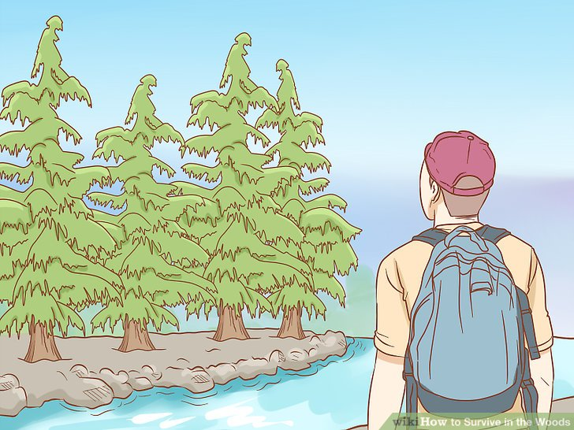

<!-- Check whether the assignment is ready to release -->
{{site.time | date: '%Y%m%d'}}
{{page.due_date | date: '%Y%m%d'}}
 
<div class="alert alert-danger">

Warning: this assignment is out of date.  It may still need to be updated for this year's class.  Check with your instructor before you start working on this assignment.
</div>

<!-- End of check whether the assignment is up to date -->


<!-- Check whether the assignment is up to date -->
{{'now' | date: '%Y'}}
{{page.due_date | date: '%Y'}}
 
<div class="alert alert-danger">
Warning: this assignment is out of date.  It may still need to be updated for this year's class.  Check with your instructor before you start working on this assignment.
</div>

<!-- End of check whether the assignment is up to date -->


<div class="alert alert-info">
This assignment is due on {{ page.due_date | date: "%A, %B %-d, %Y" }} at {{ page.due_date | date: "%I:%M%p" }} EST. 
</div>


<div class="alert alert-info">
You can download the materials for this assignment here:
<ul>

<li><a href="{{item.url}}">{{ item.name }}</a></li>

</ul>
</div>



{{page.type}} {{page.number}}: {{page.title}}
=============================================================


## Instructions

In this homework assignment, you will translate a wikiHow article into the Planning Domain Definition Language (PDDL) format that we explored in our [in-class activity on planning and PDDL](https://interactive-fiction-class.org/in_class_activities/planning/planning-and-pddl.html).  We'll also ask you to write your thoughts about how large LMs could be used to automatically generate plans from wikiHow-style instructions. 


Here's an overview of what you'll do:
1. Pick a wikihow article about a task that might be interesting in a game, or just interesting to you.
2. Traslate some of the steps into PDDL. 
* A domain definition for the wikihow article that you picked
* Schema for actions with pre-requisite and post conditions for each action
* Several problem files that each define a goal corresponding to a step in the wikiHow article, and an initial state that is solvable with your schema in >= 4 steps.
3. A JSON file that pairs the wikiHow article text with your PDDL elements plus natural language descriptions of the PDDL elements that you write.
4. Discuss how you might be able to use OpenAI to help convert a wikihow article into a schema.  What would your inputs and outputs be?  What data would you need in order to fine-tune a system?


### Step 1: Pick an Interesting wikiHow Article

We'll use create our PDDL files from a wikiHow article.  The goal for this is to start from something that describes proceedures and actions and is written in natural language, and then to manually translate it into the description language used for automated planning.

Here are a few wikiHow articles that I thought might be interesting since they had some elements that could make for interesting interactive fiction.  It's fine to pick your own article.   We won't translate the whole article, just a few steps, so you can pick out the parts that you think are most relevant / easiest to create action schema from.

Survival Stories
* [How to Survive in the Woods](https://www.wikihow.com/Survive-in-the-Woods)
* [How to Survive in the Jungle](https://www.wikihow.com/Survive-in-the-Jungle)
* [How to Survive on a Desert Island](https://www.wikihow.com/Survive-on-a-Desert-Island
) 
* [How to Survive on a Deserted Island With Nothing](https://www.wikihow.com/Survive-on-a-Deserted-Island-With-Nothing)
* [How to Get Out of Quicksand](https://www.wikihow.com/Get-Out-of-Quicksand)
* [How to Open a Coconut](https://www.wikihow.com/Open-a-Coconut)
* [How to Test if a Plant Is Edible](https://www.wikihow.com/Test-if-a-Plant-Is-Edible)
* [How to Find True North Without a Compass](https://www.wikihow.com/Find-True-North-Without-a-Compass)
* [How to Survive a Wolf Attack](https://www.wikihow.com/Survive-a-Wolf-Attack)

Kid Detectives
* [How to Make a Detective Kit](https://www.wikihow.com/Make-a-Detective-Kit)
* [How to Disguise Yourself](https://www.wikihow.com/Disguise-Yourself)
* [How to Make a Hidden Camera](https://www.wikihow.com/Make-a-Hidden-Camera)
* [How to Hide Money](https://www.wikihow.com/Hide-Money)
* [How to Spy on People](https://www.wikihow.com/Spy-on-People)
* [How to Hack](https://www.wikihow.com/Hack)
* [How to Make a Grappling Hook](https://www.wikihow.com/Make-a-Grappling-Hook)
* [How to Open a Locked Door](https://www.wikihow.com/Open-a-Locked-Door)
* [How to Create a Secret Society](https://www.wikihow.com/Create-a-Secret-Society)
* [How to Win Fights at School](https://www.wikihow.com/Win-Fights-at-School)

Dystopian Futures
* [How to Survive a Comet Hitting Earth](https://www.wikihow.com/Survive-a-Comet-Hitting-Earth)
* [How to Survive an EMP](https://www.wikihow.com/Survive-an-EMP)
* [How to Survive a Nuclear Attack](https://www.wikihow.com/Survive-a-Nuclear-Attack)
* [How to Build a Fallout Shelter](https://www.wikihow.com/Build-a-Fallout-Shelter)
* [How to Survive a Riot](https://www.wikihow.com/Survive-a-Riot)
* [How to Survive Under Martial Law](https://www.wikihow.com/Survive-Under-Martial-Law)
* [How to Avoid Danger During Civil Unrest](https://www.wikihow.com/Avoid-Danger-During-Civil-Unrest)
* [How to Thwart an Abduction Attempt](https://www.wikihow.com/Thwart-an-Abduction-Attempt)
* [How to Make Papyrus](https://www.wikihow.com/Make-Papyrus)

## Step 2: Convert the Task to PDDL


### Pick Several Steps And Think About How to Convert Them

As an example, I'll pick the [How to Survive in the Woods](https://www.wikihow.com/Survive-in-the-Woods) article, and work on translating Part 1, Step 1 into PDDL.  Here is step 1 from that article: 


<center>

</center>


> ### Finding Drinking Water
> Search for a source of fresh water.[1]  The first thing that you'll need in order to survive in the woods is water that you can drink. Look for signs of fresh water nearby like areas of green foliage that indicate water is nearby, low-lying areas where water could be collected, and signs of wildlife like animal tracks. It could mean that a creek, stream, or pond is nearby. While finding water is important for survival, be aware some water sources will not be safe - if possible treat all drinking water before using it. [2]
If there are mountains nearby, look for water collected at the foot of the cliffs.
> * The presence of insects like mosquitoes and flies means that water is nearby.
> * Water from heavily oxygenated water (such as from a big waterfall or rapids) typically is safer than that from a slow or still water source.
> * Freshwater springs are typically safer water sources, although these can be contaminated by mineral or bacteria as well.
> * Remember that all untreated water must be considered risky unless treated. Even crystal clear water can harbor diseases and be dangerous if consumed.

Here's how I think about this step in terms of PDDL:

* What is the domain?  I'll use the name of the article as my PDDL domain.
```
'survive-in-the-woods'
```
* What the goal?  Find Drinking Water.  Based on that last bullet point in Step 1, we also want  to make sure that the water is treated.  We could specify that goal in the problem definition PDDL file as something like
```
(:goal (and (inventory npc water) (treated water)))
```
* What are the actions that someone need to take in order to reach the goal?  This step is all about searching for water, so in our domain PDDL we might define an action schema called `collect_water`.  We'll say that the parameters are a person and a location.  The locations that are mentioned as having fresh water are: a creek, a stream, a pond, waterfalls, and rapids.  We coluld specify that these are sources of water by adding a predciate `(has_water ?loc)`,  or we could sepcify a sub-type of location called `water_source` and constrain the location parameter of `collect_water` be that sub-type. 

```
(:action collect-water
  :parameters (?p - person ?l1 - location) 
  :precondition (and (at ?p ?l1) (has_water ?l1))
  :effect (and (inventory ?p water) (not (treated water))
)
```


## What to submit

You should submit a link to a Github repository which contains the following:

1. An Python notebook called `XXX.ipynb` that 
2. A JSON file called `wikihow.json`
3. A PDF file containing your writeup.  You should include at least 1 paragraphs for each of the following topics:
* What article did you pick and why?
* What portions of the article did you select to translate to PDDL?
* Give some example of the actions, types, and predicates you used in your domain.
* Explain what goal you selected for your problem, and give the inital state and solution that you created.
* What limitations of PDDL did you encounter that makes it difficult to precisely convert a wikiHow description into PDDL?
* Could your PDDL be used as an interesting challenge for a text-adventure-style game?  If so, how?  If not, what would needed to create an interesting challenge?
* Discuss how you might use GPT3 to automatically or semi-automatically convert a wikiHow article to PDDL?

Submissions should be done on [Gradescope]({{page.submission_link}}).

 
## Recommended readings

* {{ reading.authors }}, <a href="{{ reading.url }}">{{ reading.title }}</a>.  <i>{{ reading.note }}</i>


