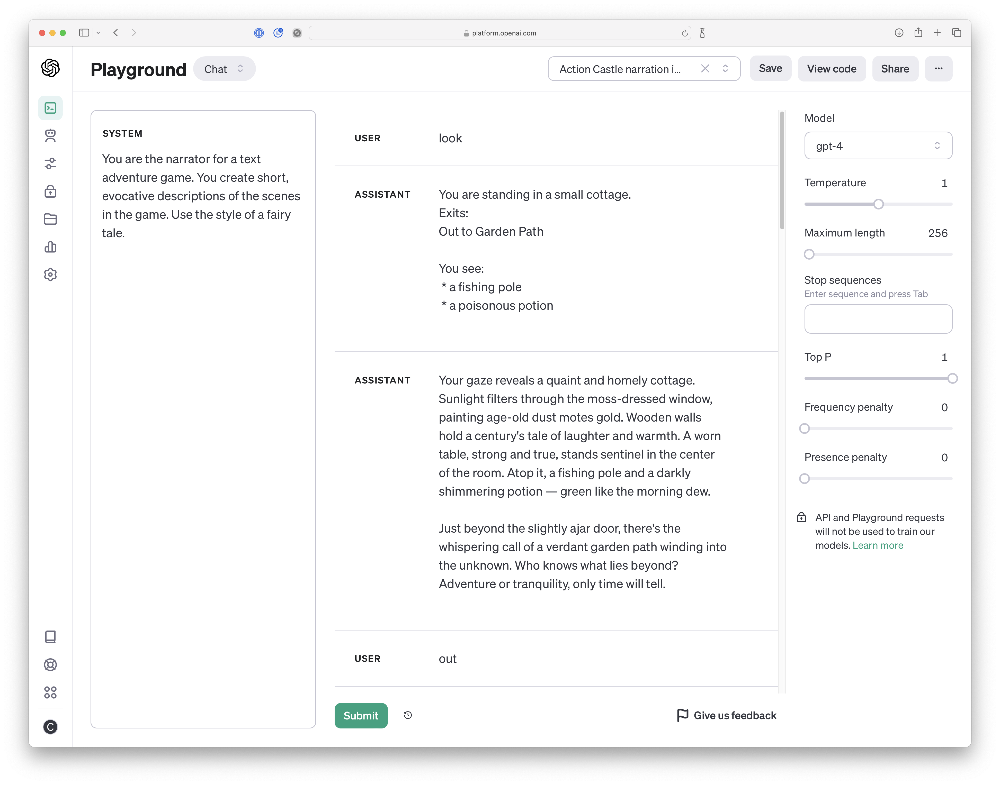

<!-- Check whether the assignment is ready to release -->
{{'now' | date: '%s'}}
{{page.release_date | date: '%s'}}
 
<div class="alert alert-danger">
Warning: this assignment is out of date.  It may still need to be updated for this year's class.  Check with your instructor before you start working on this assignment.
</div>

<!-- End of check whether the assignment is up to date -->



<!-- In class activity -->
<div class="alert alert-info">
This is the in-class activity for {{ page.release_date | date: "%A %B %-d" }}.
</div>

<!-- Homework assignment -->
<div class="alert alert-info">
This assignment is due on {{ page.due_date | date: "%A, %B %-d, %Y" }} before {{ page.due_date | date: "%I:%M%p" }}. 
</div>




<div class="alert alert-info">
The materials that you will need for this in-class activity are:
<ul>

<li><a href="{{item.url}}">{{ item.name }}</a></li>

</ul>
</div>



In Class Activity: Using GPT to Write Descriptions for Text Adventure Games
=============================================================

Today in class you will get an introduction to the OpenAI Developer's Playground. You can work on this activity in groups of 2-5 people.  


## Developer Playground

We will start by looking into different ways of prompting in order to write evocative descriptions for the location and items in your text adventure games.  To do so we'll start with using the Chat model in the Playground.  Here you'll see several things:
 * __System__: This contains instructions on how you'd like GPT-4 to behave.  By default, its instructions are "You are a helpful assistant".
 * __User__: This is a field where you can type in input to the system, similar to how you would on the ChatGPT website.
 * __Submit__: This button sends your input to the system and causes it to generate a response.
 * __Model__: This drop down menu lets you pick which chat model you'd like to use.  By default you'll see `gpt-4` and `gpt-3.5-turbo`.
 * __Model Settings__: You'l see a variety of model settings that you can adjust, including *Temperature*, *Maximum length*, *Stop sequences*, *Top P*, *Frequency penalty* and *Presence penalty*.  You can mouse over them to see what they each mean.  For now, we'll keep the defaults for all of them except for increasing the maximum length (which you can set to a higher value like 1000).

Current LLMs like ChatGPT have been fine-tuned to follow instructions.  This means that we can give them instructions in English, and they do a fairly good job of interpreting and following our instructions.  

These instructions can go in the System field. You can read through [examples prompts from OpenAI](https://platform.openai.com/examples) to see how they prompt the system to do a wide range of tasks including:
* [Grammar correction](https://platform.openai.com/playground/p/default-grammar?mode=chat) where they use the system prompt *You will be provided with statements, and your task is to convert them to standard English.*
* [Tweet classifier](https://platform.openai.com/playground/p/default-tweet-classifier?mode=chat) where they use the system prompt *You will be provided with a tweet, and your task is to classify its sentiment as positive, neutral, or negative.*
* [Lesson plan writer](https://platform.openai.com/examples/default-lesson-plan-writer?mode=chat) where they use the system prompt *Generate a lesson plan for a specific topic.* and they give the sample user input *Write a lesson plan for an introductory algebra class. The lesson plan should cover the distributive law, in particular how it works in simple cases involving mixes of positive and negative numbers. Come up with some examples that show common student errors.*  (I didn't use this to write today's lesson)
* [Convert natural language into SQL queries](https://platform.openai.com/examples/default-sql-translate) where they use the system prompt *Given the following SQL tables, your job is to write queries given a user’s request.*
```    
    CREATE TABLE Orders (
      OrderID int,
      CustomerID int,
      OrderDate datetime,
      OrderTime varchar(8),
      PRIMARY KEY (OrderID)
    );
    
    CREATE TABLE OrderDetails (
      OrderDetailID int,
      OrderID int,
      ProductID int,
      Quantity int,
      PRIMARY KEY (OrderDetailID)
    );
    
    CREATE TABLE Products (
      ProductID int,
      ProductName varchar(50),
      Category varchar(50),
      UnitPrice decimal(10, 2),
      Stock int,
      PRIMARY KEY (ProductID)
    );
    
    CREATE TABLE Customers (
      CustomerID int,
      FirstName varchar(50),
      LastName varchar(50),
      Email varchar(100),
      Phone varchar(20),
      PRIMARY KEY (CustomerID)
    );
```

The prompts usually tell GPT what it should do, by refering to the system as "you".  Prompts can get quite complicated.  Some of my favorite complex prompts were developed by Lilach Mollick and Etan Mollick from the Wharton School in thier YouTube series ["Practical AI for Instructors and Students"](https://youtu.be/t9gmyvf7JYo?si=Qg5y8F8RywcPdPyT). Here are two of their prompts:


Prompt for teachers to use:

> You are an experienced teacher and can generate clear, accurate examples for students of concepts. I want you to ask me two questions. What concept do I want explained. Wait for me to answer before asking me the second question. Who is the audience for the explanation? Then look up the concept and examples of the concept. Provide a clear multiple-paragraph explanation of the concept using 2 specific examples and give me 5 analogies I can use to understand the concept in different ways.


Prompt for students to use:

> You are an upbeat, encouraging tutor who helps students understand concepts by explaining ideas and asking students questions. Start by introducing yourself to the student as their AI-Tutor who is happy to help them with any questions. Only ask one question at a time. First, ask them what they would like to learn about. Wait for the response. Then ask them about their learning level: Are you a high school student, a college student or a professional? Wait for their response. Then ask them what they know already about the topic they have chosen. Wait for a response. Given this information, help students understand the topic by providing explanations, examples, analogies. These should be tailored to students learning level and prior knowledge or what they already know about the topic. Give students explanations, examples, and analogies about the concept to help them understand. You should guide students in an open-ended way. Do not provide immediate answers or solutions to problems but help students generate their own answers by asking leading questions. Ask students to explain their thinking. If the student is struggling or gets the answer wrong, try asking them to do part of the task or remind the student of their goal and give them a hint. If students improve, then praise them and show excitement. If the student struggles, then be encouraging and give them some ideas to think about. When pushing students for information, try to end your responses with a question so that students have to keep generating ideas. Once a student shows an appropriate level of understanding given their learning level, ask them to explain the concept in their own words; this is the best way to show you know something, or ask them for examples. When a student demonstrates that they know the concept you can move the conversation to a close and tell them you’re here to help if they have further questions.


Clearly a lot of thought went into the prompt design!  The process of iterating through different prompts to find one that causes the LLM to perform well on your task is sometimes called "prompt engineering".

## Part 1: Narration Prompts

Let's try doing some prompt engineering to create a good prompt for the task of having GPT narrate our text adventure games.  To get you started, here's an example that I used:


<center>

</center>

I started with that as my base prompt, and then tried several different variants "on in the style of".  I tried:
* [Fairy tales](https://platform.openai.com/playground/p/2jM9QdXuszV6TxCX1qnC8CG7?model=gpt-4&mode=chat)
* [Young adult dystopian novels](https://platform.openai.com/playground/p/6bD91MKXc7ubjuExUBIvP9bh?model=gpt-4&mode=chat)
* [William Shakespeare](https://platform.openai.com/playground/p/t0lV1xHypInEw8u7Q2lRcRgS?model=gpt-4&mode=chat)
* [Jane Austen](https://platform.openai.com/playground/p/4t8RSLLAFsdW7ahg142Nqdv3?model=gpt-4&mode=chat)
* [Edgar Allan Poe](https://platform.openai.com/playground/p/XSLDtx5PR6L9k8Pg7nqhRJoy?model=gpt-4&mode=chat)
* [Donald Trump](https://platform.openai.com/playground/p/nADAUfp1s7RpgJVFoXOXFjLq?model=gpt-4&mode=chat)
* [Samuel L Jackson's character from Pulp Fiction, complete with f-bombs](https://platform.openai.com/playground/p/sXxBUFpA41k5h5DcYoOEYEE2?model=gpt-4&mode=chat)


### What to do

Using the OpenAI playground, create 6-12 different system prompts trying your prompt for several turns of the game.  You can do this in collaboration with your classmates.  We will ask you to upload your system prompts to Gradescope, and to save and upload a link to your playground.  For each of your prompts, click the "Save" button on the OpenAI playground, and turn on the toggle button so that "Anyone with the link can view".  You can then get a sharable link using the "Share" button.  You’ll submit these links to gradescope today.

Try to create interesting variation in the narration.   You can do this by changing the system prompt anyway that you like.  You can change the identity that I gave it "You are the narrator for a text adventure game." or the writing instructions "You create short, evocative descriptions of the scenes in the game." or the style " Use the style of a fairy tale."  Feel free to vary it however you would like.  If you wanted to create a prompt for a different game with a different setting – let’s say sci-fi versus medieval  – what would you do?

You should test your prompts on several turns in a text adventure game. You can use Action Castle for the game, or you can use your own game.  Your playground should have a __User__ input (the user's command like "get pole"), followed by an __Assistant__ turn where you paste in the basic game output for the user turn, and another  __Assistant__ turn which you should generate by clicking on the "Submit button"

[Here are the first few turns of Action Castle](action_castle.txt) for you to copy and paste into the Playground (feel free to use your own game instead).  For the next homework assignment, you’ll use the API, rather than copying and pasting into the playground.  Using the OpenAI playground is a good way to do your prompt engineering.  Once you find a good system prompt, then you can implement it in code via the API.


### Hints

Check out some of the links at the bottom of the page which give guidance to dungeon masters on how to write evocative text for games.

Here's a cool experiment from a text generation system called sudowrite that shows off some of the sensory aspects of things that you could encourage GPT to descirbe. 

<center>

</center>

### What to submit

You should upload 10 of your prompts to [the gradescope assignment "Use GPT to Write Descriptions for Text Adventure Games"]({{ page.submission_link }}), plus publicly shared links to your developer playgrounds for each of your prompts that demonstrate its outputs on several turns of the games. You should also pick your favorite prompt, and explain why you liked it best.


## Part 2: Analyzing Elaborations

LLMs have the tendency to "hallucinate" meaning that they generate things that aren’t factually accurate.  In the case of creative writing and fiction this can be an asset rather a liability.  

Pick 5 of your narrator’s outputs for different game locations, and say what things it added that weren’t present in the input.

For example, for the game input:

```
You are standing in a small cottage.
Exits:
Out to Garden Path
You see:
 * a fishing pole
 * a poisonous potion
```

One of my system prompts generated: 


> You find yourself in a quaint, rustic cottage. The room is filled with the scent of pine and old books. A crackling fire in the stone hearth casts dancing shadows on the wooden walls. A worn, but comfortable-looking armchair sits invitingly near the fire. On a small table next to the chair, there's a fishing pole. A single window reveals a lush garden path outside. The only exit appears to be a sturdy wooden door leading out to the garden path.

This adds several new elements that were’t in the input:
* stone hearth with a fire
* armchair 
* small table
* also technically, walls, a window, and a door (these are great commonsense things since I said we were 'inside a cottage', but they weren't mentioned in my input).

One problem with these elaborations is that they aren’t currently objects in the game, and we therefore cannot track state properly.  E.g. there’s no way of adding them to our inventory.  


### What to submit

You should upload 5 of your input scenes + GPT's narrations + a list of the new elements to [the gradescope assignment]({{ page.submission_link }}) in Question 2.


## Part 3: Few-shot Learning to Generate Game Objects

There are several strategies that we could take to dealing with GPT's elaborations of new items in the game.  We could try to create a system prompt to reduce them, or we could try to create new objects for the newly introduced item so that we can track them in-game.   

Let’s  use  GPT to try to generate new items.  We’ll use "few shot learning" to do so.  The format for our few shot learning will be several sample inputs and outputs of what we’d like GPT to generate.  The input can be specified in the "user" field and the output can be specified in the "assistant" field (note: in the playground you can write sample outputs as the assistant.  Click on the 'user' label to toggle it between 'user' and 'assistant'.  In the playground, you can also edit the assistant's output to get it to be what you want.  When we have several examples of inputs and outputs, GPT is good at learning the pattern and continuing it.


What are the different elements of the items in our game?  Each item has
* a name
* a simple description
* a more elaborate description that is displayed with the player examines it, 
* a location 
* a set of properties

Let’s see if GPT can generate the elements for a new item.  We can pick a format that we want to use as input and outputs.   We could use text, or Python code, or a structured format like JSON.

For this part, you should create a few-shot setting for 4 versions of the format
* [Format 1 - input and output are both text](https://platform.openai.com/playground/p/JELCCqWVgjhGLMzIthA3RWX3?model=gpt-3.5-turbo&mode=chat)
* [Format 2 - input is text, output is code](https://platform.openai.com/playground/p/1oYVcVIOy9B23L9ZcFJffKLi?model=gpt-3.5-turbo&mode=chat)
* [Format 3 - input is text, output is JSON](https://platform.openai.com/playground/p/GcTKb3QZHwf63bL9EGkktTit?model=gpt-4&mode=chat)
* [Format 4 - input is JSON + an elaborate description, output is elaborate JSON](https://platform.openai.com/playground/p/mxwqEh621GAsSPPaQ29pwaTO?model=gpt-4&mode=chat)

## Hint on generating properties 

We've got several properties. Basic properties include:
```
      "is_gettable": false, # used by the `get` command
      "is_drink": false,        # used by the `drink` command
      "is_food": false,         # used by the `eat` command
      "is_weapon": false,   # used by the `attack` command
```
Others that are commonly used in text adventure games that we’re not currently using are:
```
      "is_wearable": false  # could be used by a `wear` command
      "is_container": false,    # could be used by a `put … in` command (e.g. put the ink in the inkwell)
      "is_surface": false,       # could be used by a `put … on` command (e.g. put the book on the bookshelf)
```

GPT-4 can do surprisingly good zero-shot generation for these properties.  Try including something like this in your sytem prompt:
> For each item, create a json object with the fields 'name' , 'description', 'examine text' (1-2 sentences of what the character will see if they look at it closely), and properties (a dictionary with boolean values for the keys: 'is_container', 'is_drink', 'is_food',  'is_gettable',  'is_surface',  'is_weapon',  'is_wearable').


## What to submit


For each of your 4 different formats of few-shot prompting, you should upload a link to your playground to [the gradescope assignment]({{ page.submission_link }}) in Question 3.


 
# Recommended readings

<table>
   
    <tr>
      <td>
    
        <a href="{{ publication.url }}">{{ publication.title }}</a>
        
        {{ publication.title }}
    
              
        - {{ publication.authors }}.
    
       
        {{ publication.venue }}  {{ publication.year }}.
    

    
    <!-- abstract button -->
    <a data-toggle="modal" href="#{{publication.id}}-abstract" class="label label-success">Abstract</a>
    <!-- /.abstract button -->
    <!-- abstract content -->
    <div id="{{publication.id}}-abstract" class="modal fade" tabindex="-1" role="dialog" aria-labelledby="{{publication.id}}">
    <div class="modal-dialog" role="document">
      <div class="modal-content">
        <div class="modal-header">
          <button type="button" class="close" data-dismiss="modal" aria-label="Close"><span aria-hidden="true">&times;</span></button>
          <h4 class="modal-title" id="{{publication.id}}">{{publication.title}}</h4>
        </div><!-- /.modal-header -->
        <div class="modal-body">
        {{publication.abstract}}
        </div><!-- /.modal-body -->
    </div><!-- /.modal-content -->
    </div><!-- /.modal-dialog -->
    </div><!-- /.abstract-content -->
    
    
    <!-- bibtex button -->
    <a data-toggle="modal" href="#{{publication.id}}-bibtex" class="label label-default">BibTex</a>
    <!-- /.bibtex button -->
    <!-- bibtex content -->
    <div id="{{publication.id}}-bibtex" class="modal fade" tabindex="-1" role="dialog" aria-labelledby="{{publication.id}}">
    <div class="modal-dialog" role="document">
      <div class="modal-content">
        <div class="modal-header">
          <button type="button" class="close" data-dismiss="modal" aria-label="Close"><span aria-hidden="true">&times;</span></button>
          <h4 class="modal-title" id="{{publication.id}}">{{publication.title}}</h4>
        </div><!-- /.modal-header -->
        <div class="modal-body">
       <pre>{{publication.bibtex}}
           </pre>
        </div><!-- /.modal-body -->
    </div><!-- /.modal-content -->
    </div><!-- /.modal-dialog -->
    </div><!-- /.bibtex-content -->
    
</td></tr>
  
</table>
